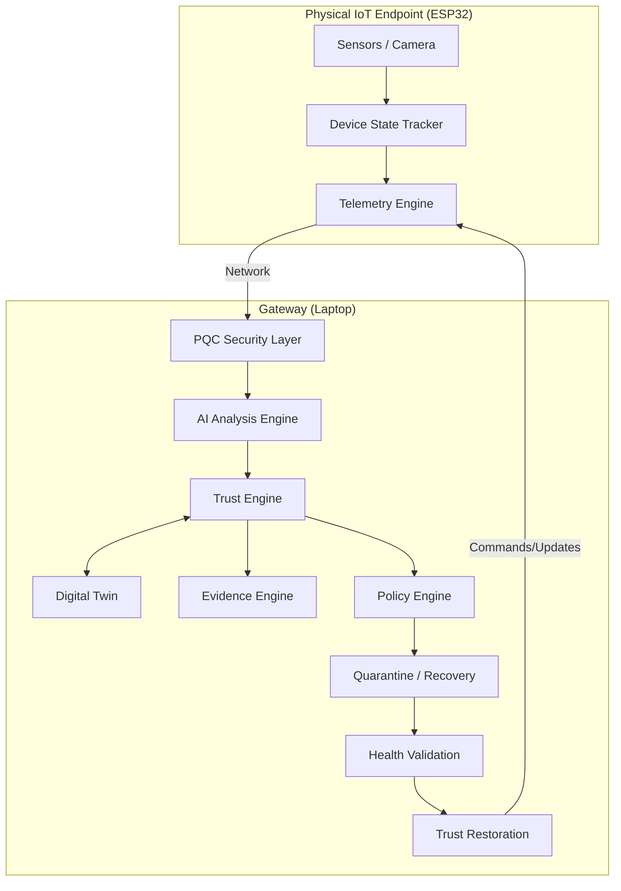

# System Architecture

## Overview

Q-SHIELD operates as a closed-loop system dividing responsibilities between a lightweight, vulnerable physical edge (ESP32) and a powerful, intelligent, and secure central hub (Laptop).

## Data Flow

### Component Breakdown

1. **ESP32 (Edge)**
   - Acts as the physical IoT endpoint.
   - Handles sensor data acquisition.
   - Streams telemetry securely.
   - Reports basic physical tamper states (e.g., Reed switch).

2. **Laptop (Gateway & Hub)**
   - Runs the **AI Analysis** for cross-modal anomaly detection.
   - Provides the **PQC Gateway** for ML-KEM/ML-DSA.
   - Hosts the **Backend Services**.
   - Operates the **Trust Engine**, mapping observed behavior against the **Digital Twin**.
   - Serves the frontend **Dashboard**.
   - Orchestrates automated **Quarantine & Recovery** loops.
