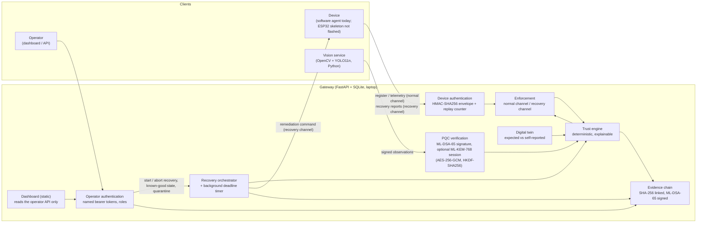

# System Architecture (as implemented)

Q-SHIELD has three kinds of client and one gateway. Each client authenticates differently, and the authentication
methods are never interchangeable.

## Responsibilities

- **Device.** Sends HMAC-SHA256 authenticated register, heartbeat and telemetry messages: tamper switch, sensors,
  firmware version and configuration hash. Today this is a software agent (`device_agent/`) labelled Simulated. The
  ESP32 firmware in `hardware/esp32/` is an untested skeleton.
- **Vision service** (`ai/vision/`). Runs YOLO11n on webcam frames and reports detections and camera-health changes
  as observations. Each observation is ML-DSA-65 signed by the service's own key (the webcam has no cryptographic
  identity), and can be sent inside an ML-KEM-768 session. It reports what it sees; it decides nothing about trust.
- **Gateway.**
  - Authenticates each kind of client.
  - Enforces quarantine after authentication.
  - Runs the trust engine over its own records.
  - Keeps the digital twin and drives recovery.
  - Appends every decision to the evidence chain.
  - Serves the dashboard as static files.
- **Operator.** A named identity with a role (viewer, operator or admin). Every action is attributed in the evidence
  chain.

The trust model is specified in `trust-engine.md`. Design decisions and their limits are in
`../technical-decisions.md`.
